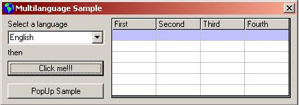



## Adding multiple language support to captions of controls

### Description

This is a small sample to add multilanguage support to programs you developed. All the job is done in the module. For forms with lots of controls I prefer you modify the database and function to run 1 query for each language and let the program do it, 1 query for each control means slow program.

Added : MsgBoxes, Grid Headers, Form Captions.
 
### More Info
 
Please check the codes before modifying database and/or Language.ini file

             |
---                |---
**Submitted On**   |2005-04-15 14:14:58
**By**             |[Serdar Tas](https://github.com/Planet-Source-Code/PSCIndex/blob/master/ByAuthor/serdar-tas.md)
**Level**          |Advanced
**User Rating**    |4.3 (17 globes from 4 users)
**Compatibility**  |VB 6\.0
**Category**       |[Miscellaneous](https://github.com/Planet-Source-Code/PSCIndex/blob/master/ByCategory/miscellaneous__1-1.md)
**World**          |[Visual Basic](https://github.com/Planet-Source-Code/PSCIndex/blob/master/ByWorld/visual-basic.md)
**Archive File**   |[Adding\_mul1878084182005\.zip](https://github.com/Planet-Source-Code/serdar-tas-adding-multiple-language-support-to-captions-of-controls__1-60007/archive/master.zip)

### API Declarations

Language ID is declared global to be able to use on everyform you have.

